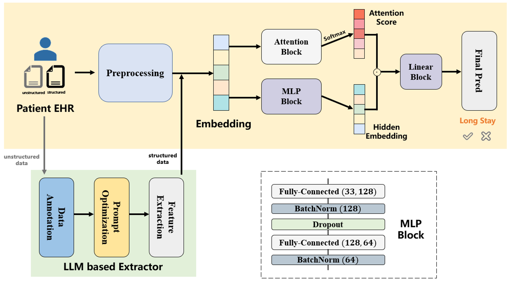

# SchizoLOSPrediction


Leveraging Deep Neural Network and Large Language Models for Long-Term Hospitalization Risk Prediction in Schizophrenia Patients



## Dependencies
```angular2html
python == 3.9
torch == 2.2.2+cu121
sklearn == 1.4.1.post1
shap == 0.45.0
```

### Citation
```angular2html

```